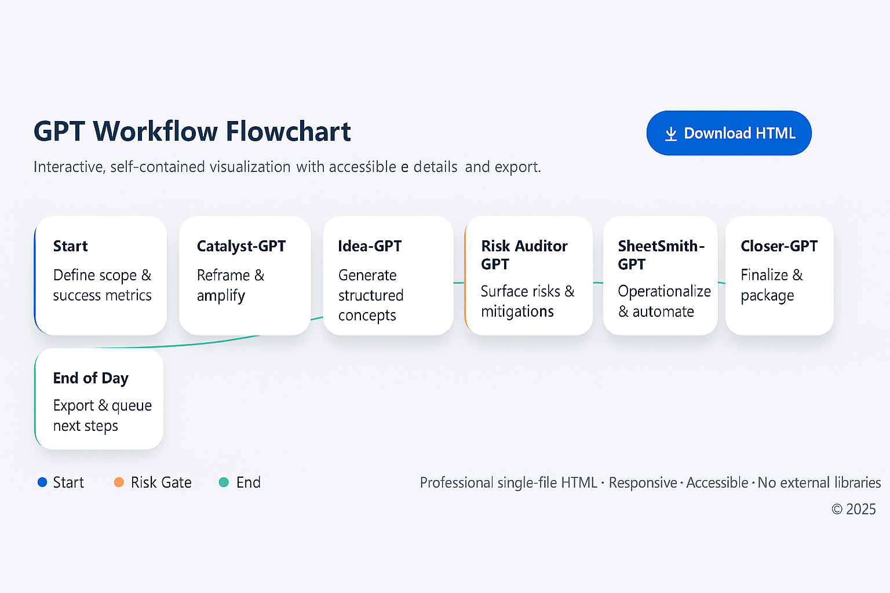

## Learn More (Full Docs)
For full documentation (prompts, outputs, changelog, history), see:
👉 https://github.com/ohadmoscko/GPT-backups

# FirstWorkflow – AI Agent Demo

This repository hosts the **live demo** of the AI Agent Workflow project.
It shows how a team of specialized AI agents (Ideas, Strategy, Risk, Documentation, Packaging, etc.) collaborate step by step.

## Features
- Single-file HTML app (`index.html`)
- Visual workflow of agents
- Simple example case study (manual → automated handoffs)

## Learn More (Full Docs)
For full documentation (prompts, outputs, changelog, history), see:
👉 https://github.com/ohadmoscko/GPT-backups

## Screenshot

## License
MIT (see [LICENSE](./LICENSE))
