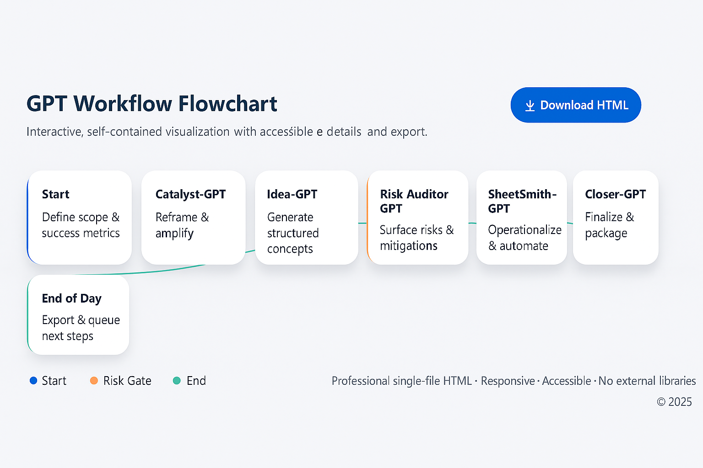

# FirstWorkflow – AI Agent Demo

This repository hosts the **live demo** of the AI Agent Workflow project.  
It shows how a team of specialized AI agents (Ideas, Strategy, Risk, Documentation, Packaging, etc.) can collaborate step by step.

## Features
- Single-file HTML app (`index.html`)
- Visual workflow of agents
- Example case studies (manual → automated process)
- Screenshots included in `assets/`

## Demo
- Live preview: [index.html](./index.html)  
- Screenshot:  
  

## Learn More
For **full documentation, prompts, changelogs, and project history**, see the companion repo:  
👉 [GPT-backups](https://github.com/ohadmoscko/GPT-backups)

## License
MIT License (see [LICENSE](./LICENSE))
